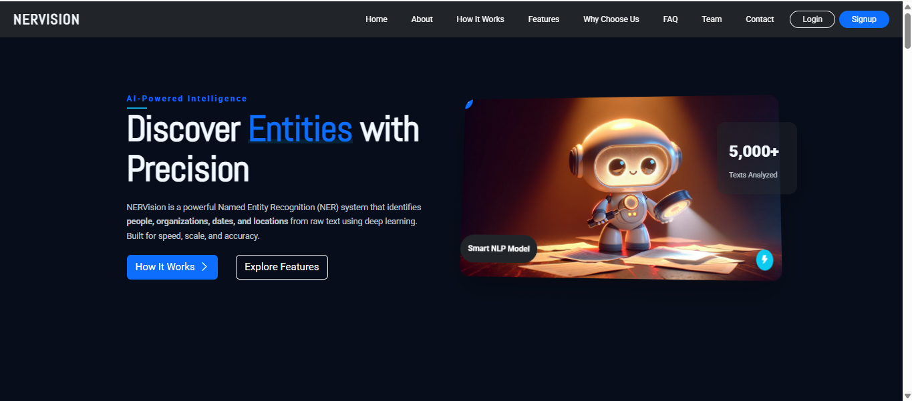
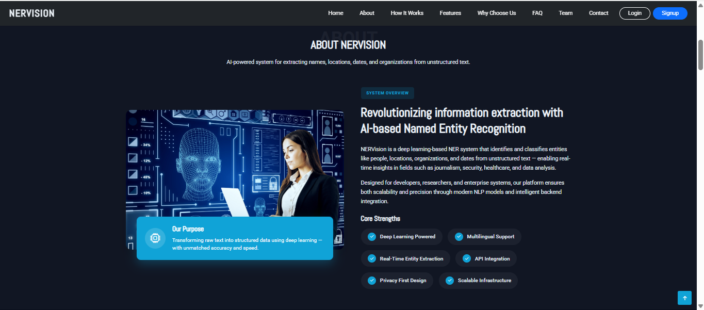
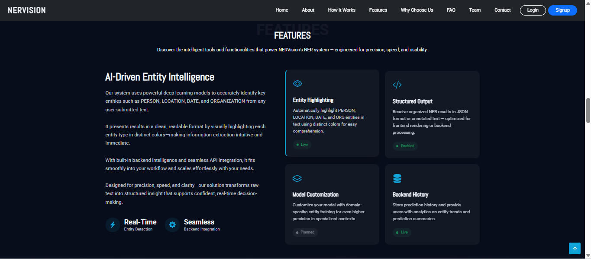
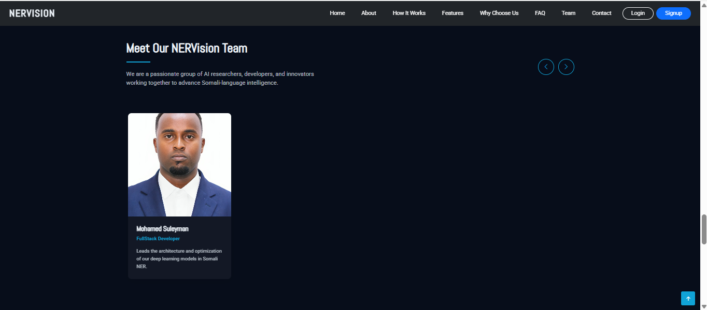
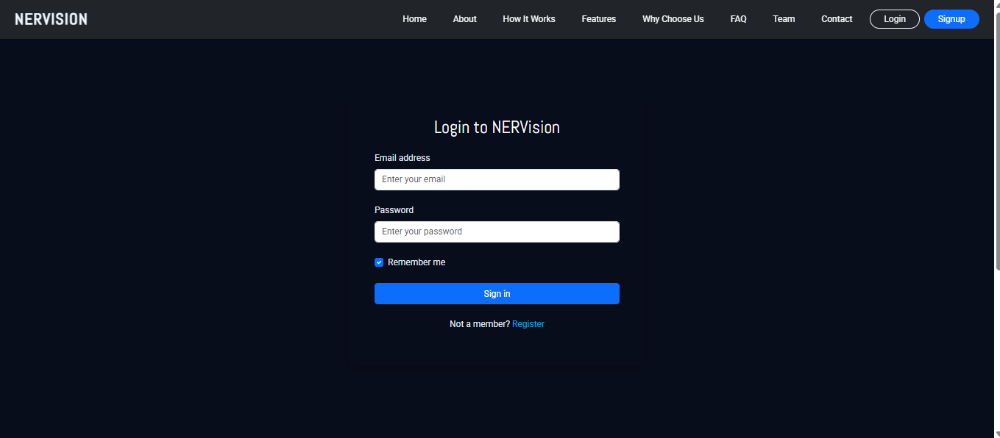
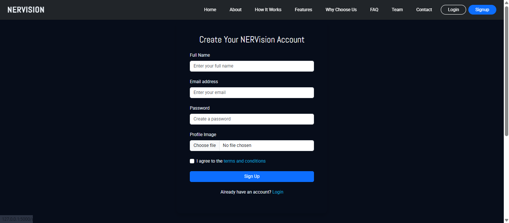
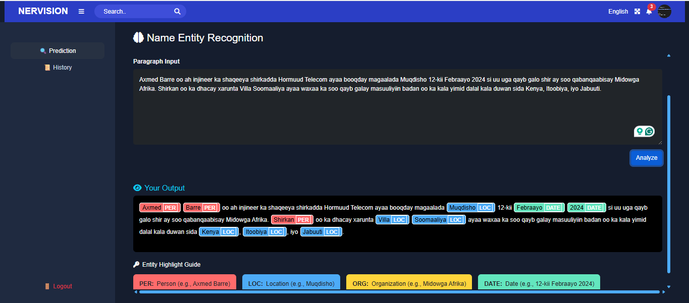
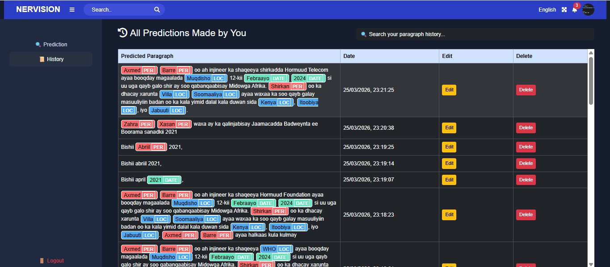

# 🤖 NERVISION AI

An AI-powered Named Entity Recognition (NER) system designed to analyze Somali text and extract meaningful entities such as persons, locations, organizations, and dates. This project demonstrates full-stack development combined with machine learning integration.

---

## 🚀 Features

* 🔐 User Authentication (Signup & Login)
* 🔒 Secure Password Hashing
* 👤 Profile Image Upload
* 🧠 AI-Based NER Prediction (spaCy Model)
* 🎨 Highlighted Entity Visualization (PER, LOC, ORG, DATE)
* 📊 Interactive Dashboard
* 🕒 Prediction History Tracking
* ✏️ Update & Delete History
* 📱 Responsive UI (Mobile & Desktop)

---

## 🧠 Entity Types Supported

* 👤 **PER** → Person (e.g., Axmed Barre)
* 📍 **LOC** → Location (e.g., Muqdisho)
* 🏢 **ORG** → Organization (e.g., Midowga Afrika)
* 📅 **DATE** → Date (e.g., 12-kii Febraayo 2024)

---

## 📸 Screenshots

### 🏠 Home Page

<p align="center">
  
</p>

### ℹ️ About Section

<p align="center">
  
</p>

### ✨ Features Section

<p align="center">
  
</p>

### 👥 Team Section

<p align="center">
  
</p>

### 🔐 Login Page

<p align="center">
  
</p>

### 📝 Signup Page

<p align="center">
  
</p>

### 🤖 Prediction Dashboard

<p align="center">
  
</p>

### 📜 History Dashboard

<p align="center">
  
</p>

---

## 🛠️ Tech Stack

### Frontend

* HTML
* CSS
* Bootstrap
* JavaScript
* jQuery

### Backend

* Flask (Python)

### Database

* MySQL

### AI / NLP

* spaCy (Custom Trained Model)

---

## 🧠 Concepts Applied

* Full-Stack Web Development
* REST API Design
* Session-Based Authentication
* File Upload Handling
* Natural Language Processing (NLP)
* Machine Learning Model Integration
* Data Persistence & History Tracking

---

## 📁 Project Structure

```
NERVISION SYSTEM/
│
├── docs/                  # Screenshots
│   ├── Home.png
│   ├── About.png
│   ├── Features.png
│   ├── Login.png
│   ├── Signup.png
│   ├── Prediction_dashboard.png
│   └── History_dashboard.png
│
├── .venv/
├── node_modules/
├── output/               # spaCy trained model
├── static/
├── templates/
│
├── .gitignore
├── app.py
└── README.md
```

---

## 🗄️ Database Setup

Create database:

```
CREATE DATABASE NER;
```

Create tables:

```
CREATE TABLE users (
    id INT AUTO_INCREMENT PRIMARY KEY,
    name VARCHAR(100),
    email VARCHAR(100) UNIQUE,
    password TEXT,
    profileImage TEXT
);

CREATE TABLE history (
    id INT AUTO_INCREMENT PRIMARY KEY,
    email VARCHAR(100),
    predictedText LONGTEXT,
    date TIMESTAMP DEFAULT CURRENT_TIMESTAMP
);
```

---

## ⚙️ Getting Started

### 1. Clone Repository

```
git clone https://github.com/your-username/nervision-ai.git
cd nervision-ai
```

### 2. Install Dependencies

```
pip install flask numpy spacy mysql-connector-python werkzeug tensorflow pillow
```

### 3. Run Application

```
python app.py
```

### 4. Open Browser

```
http://localhost:5000
```

---

## 🔍 Example

**Input:**

```
Axmed Barre ayaa tagay Muqdisho 12-kii Febraayo 2024
```

**Output:**

* Axmed Barre → PER
* Muqdisho → LOC
* 12-kii Febraayo 2024 → DATE

---

## 🌍 Future Improvements

* 🌐 Deploy to cloud (Render / Railway)
* 📱 Improve mobile responsiveness
* 🌎 Multi-language NER support
* 🤖 Advanced deep learning models
* 📊 Analytics dashboard

---

## 👨‍💻 Author

**Mo (Full Stack Developer)**

---

## ⭐ Support

If you like this project, give it a ⭐ on GitHub!
